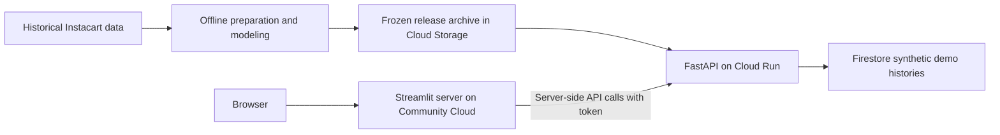

# Customer Segmentation & Personalization Platform

*A case study in evidence-driven recommendation: when the simple baseline wins*

Prepared by Ashok

> **Portfolio case study | October 2026.** Source code, evaluation artifacts, and a guided demo are available for discussion during interviews. The implementation repository is private and can be made temporarily public for an interview or demonstrated from my development environment.

**Stack:** Python · scikit-learn · implicit ALS · FastAPI · Google Cloud Run · Streamlit · MLflow · Airflow · Evidently

---

## Executive Summary

I built a customer segmentation and next-basket recommendation platform using the public Instacart grocery dataset. The work covers data preparation, behavioral features, model comparison, API development, a browser demo, and cloud deployment. The main result was that a personal-purchase-frequency baseline outperformed the tested collaborative-filtering models, so I selected it for serving.

I compared five baselines and ten alternating-least-squares (ALS) collaborative-filtering configurations using a sequential validation split that keeps future baskets out of training. A transparent baseline that ranks a customer's own most-purchased products, filled from their segment's popularity, scored Recall@10 of 0.333 and NDCG@10 of 0.395. The best ALS trial reached 0.191 and 0.208. The simpler method was selected and shipped; on a final holdout consumed exactly once it scored 0.323 and 0.391. The portfolio deployment uses Google Cloud Run for the API and Streamlit Community Cloud for the private demo interface. It is an interview demonstration, not a commercial production service.

## 1. Background and Problem

In grocery shopping, a large share of what a customer buys next is something they have bought before. That changes what a good recommender looks like: novelty is not the goal, and a sophisticated latent-factor model has to beat a simple count of what the customer already buys. The project asked two questions. Which approach ranks the products in a customer's next completed basket most accurately? And how can the winner be shipped as a service without leaking future information into evaluation or overstating what the evidence supports?

The dataset also constrains the work. It has no prices, no absolute calendar dates, and no demographics. Recorded inter-order gaps are capped at 30 days: a value of 30 means 30 or more, not an exact elapsed interval. Day-of-week codes have no verified mapping to weekday names. Monetary RFM (recency, frequency, monetary value) and calendar recency are therefore impossible, so I used behavioral features without interpreting them as spend or validated churn indicators.

## 2. Approach and Responsibilities

I explored features and models in notebooks, then moved stable logic into reusable Python classes. My responsibilities included designing the evaluation protocol, validating histories, comparing models, building the API and UI, packaging the application, and configuring deployment and operational checks.

My Python and QA background shaped three decisions:

- **Establish useful baselines first.** Compare ALS with purchase-frequency and popularity methods using the same candidates, histories, and metrics.
- **Separate training from inference.** Fit population artifacts only on training histories. New demo baskets can change a customer's features and ranking without refitting the model.
- **Treat validation as part of the product.** Reject invalid histories, preserve deterministic rankings, verify artifact integrity, and test persistence and failure behavior as well as successful requests.

## 3. Architecture

The artifact download occurs during API startup. Each subsequent inference request
uses loaded artifacts; the browser and Streamlit server do not train models.

### Data preparation

Six raw Instacart tables are validated and reduced to a sample of 10,000 customers (seed 42) with complete observed histories, at least four orders, and a labeled last order in the source training set. Customers whose last source order is unlabeled are excluded. Complete observed history does not mean a customer's entire lifetime. A sequence manifest assigns each order a role (train, validation, or final). For a customer with six baskets, baskets 1–4 train the population models, basket 5 selects the method, and basket 6 is reserved for final evaluation. After model selection, baskets 1 through 5 become the observed input for predicting basket 6, while fitted population artifacts remain frozen. This is an existing-customer sequential evaluation, not an unseen-customer test or a global calendar-time backtest.

### Features and segmentation

Each customer is described by 32 raw features (30 used by the model): order count, basket size, repeat share, gaps between orders, 21 department shares, and cyclical hour-of-day and day-of-week encodings. Skewed counts are log-transformed and feature groups are balanced so that 21 department columns do not dominate the distance calculation. K-Means was fitted for K = 2 to 8, and K = 4 was chosen explicitly for its interpretable profiles. Customers with fewer than three orders (1,160 of 10,000) are returned as insufficient history rather than assigned an unreliable persona.

| Segment (reviewed name) | Customers | Evidence from measured profile |
|---|---:|---|
| Frequent repeat shoppers | 2,460 | Highest mean order count (36.4) and repeat share (0.648) |
| Morning beverage/snack shoppers | 1,905 | Beverages and snacks over-indexed; peak ordering at 10:00–11:00 |
| Produce-focused shoppers | 2,123 | Produce share 0.485, about 20 points above the population mean |
| Later-day shoppers | 2,352 | Highest order shares at 16:00–17:00 |

*Names were assigned after inspecting cluster profiles, not before. Cluster IDs are arbitrary and carry no ranking.*

Separation is weak: the K = 4 silhouette score is 0.090, below the 0.102 of K = 2. Results are highly stable across random seeds (pairwise Adjusted Rand Index, or ARI, 0.976–0.998) but sensitive to how feature groups are weighted (0.35–0.52). ARI measures agreement between cluster assignments after accounting for chance; it is not classification accuracy. The weight-sensitivity range refers to separately halving each feature group's squared-distance contribution. The segments are therefore descriptive groupings of shopping tendencies, not ground-truth customer classes.

### Recommendation

Customer-product purchase counts form a sparse matrix of 10,000 by 34,636 products with 606,674 nonzero entries. Five baselines were evaluated: global popularity, segment popularity, most recent basket, personal frequency, and personal frequency with segment fill. Ten bounded ALS trials varied factors, regularization, iterations, and confidence scaling, with purchases treated as implicit feedback and repeat counts converted to a log-scaled confidence weight. Repeat purchases remain eligible, since repeating is the behavior being predicted. ALS learns customer and product latent vectors; their dot products rank products and are not calibrated purchase probabilities. K-Means supplies customer clusters, not recommendation factors. Candidate products must have appeared in training; merely being in the 49,688-product catalog does not make a product recommendable.

### Serving and deployment

- **API:** FastAPI validates requests, provides separate liveness and readiness checks, and protects cloud requests with a shared Bearer token. It supports existing customers, saved synthetic demo histories, and supplied histories without persistence.
- **Cold-start behavior:** an explicitly supplied empty history receives global-popularity recommendations. Customers with fewer than three orders can receive recommendations without a cluster assignment. Unknown stored IDs are rejected; catalog-unknown products are rejected, while catalog-known products outside the training candidates are ignored for ranking and reported.
- **Cloud deployment:** a Docker container runs on Cloud Run with pinned dependencies. It downloads a versioned, checksum-verified model archive from private Cloud Storage at startup. Firestore stores synthetic demo histories separately from benchmark data.
- **Delivery:** GitHub Actions builds images and runs focused tests. Manually triggered deployment uses Workload Identity Federation, which avoids storing a long-lived cloud credential in the workflow.
- **Interface:** the browser connects to Streamlit; Streamlit's Python server calls the API. The UI does not load models or connect directly to the database.

Requests use frozen models and explicit observed histories. The application does not ingest a live retailer feed or retrain during inference.

### MLOps tooling

MLflow records experiment runs and registers complete release bundles. Airflow orders a five-task manual batch workflow that defaults to auditing the saved release. Evidently produces feature-drift reports, and a promotion gate checks whether a candidate meets documented floors and required reviews. These tools run on demand; none is presented as a continuously operating production service, and a completed training run never deploys itself.

## 4. Results

Validation comparison across all 10,000 customers at K = 10, with equal weight per customer. Recall@10 is the fraction of target-basket products retrieved; NDCG@10 rewards placing relevant products earlier. Both include unsupported target products in their denominators. The validation set has 801 target entries outside the training candidate set. These offline metrics are not measured sales uplift:

| Method | Recall@10 | NDCG@10 |
|---|---:|---:|
| Global popularity | 0.0697 | 0.0963 |
| Segment popularity | 0.0734 | 0.0985 |
| Most recent basket + global fill | 0.2606 | 0.3191 |
| Best ALS trial of ten | 0.1906 | 0.2081 |
| Personal frequency + global fill | 0.3332 | 0.3953 |
| **Personal frequency + segment fill (selected)** | **0.3334** | **0.3954** |

The selected method's absolute edge over personal frequency **with global fill** is 0.000164 in Recall@10 and 0.000066 in NDCG@10. These are observed differences, not demonstrated statistically significant or business gains. It was selected because it scored highest under the declared rule (validation NDCG@10), and its segment fill supplies items when a customer's personal list is short. Within these ten bounded ALS trials, the baseline has substantially higher validation metrics; this does not establish that all possible ALS configurations would underperform. A plausible reading is that in repeat-heavy grocery data a customer's own purchase counts are a stronger signal than shared latent structure, though the project did not run an experiment to confirm why.

Final holdout, selected method only, scored once: Recall@10 0.323, NDCG@10 0.391, candidate coverage 0.352, with 12,187 unique products recommended and no short lists. The saved final report records 885 unsupported target entries, retained in the metric denominators. Candidate coverage uses the 34,636 training products as its denominator, not the full catalog. The final holdout was reserved for the selected method and evaluated once. Further model selection requires a new evaluation protocol.

## 5. Key Engineering Decisions

| Decision | Alternative considered | Why this one |
|---|---|---|
| Sequential per-customer split with a one-time final holdout | Random row split | Prevents future purchases leaking into training; calendar split impossible without dates |
| Behavioral features instead of RFM | Monetary RFM, calendar recency | No prices or dates in the data; avoids implying spend or churn |
| Explicit K = 4 with a minimum of three orders | Highest silhouette (K = 2); assign every customer | Interpretable profiles, with weak separation disclosed; unsupported customers stay unassigned |
| Ship the baseline, keep ALS as comparison | Deploy ALS as the more advanced model | Validation evidence favored the baseline |
| Frozen population state, history-based inference | Refit on every basket | Personalizes without request-time training or leakage |
| API separate from the UI | UI owns models and data | Independently callable contracts and one consistent inference path |
| Local on-demand MLflow, Airflow, and Evidently | Hosted always-on MLOps stack | Fits portfolio cost and scope, and avoids calling historical replay a live pipeline |

## 6. Technology Stack

| Layer | Technologies |
|---|---|
| Data and modeling | Python, pandas, scikit-learn (K-Means), SciPy sparse matrices, implicit (ALS) |
| Serving | FastAPI, Pydantic, Uvicorn, Bearer-token authentication |
| Cloud | Google Cloud Run, Artifact Registry, Cloud Storage, Firestore, Secret Manager, Workload Identity Federation |
| Interface | Streamlit, Streamlit Community Cloud |
| MLOps | MLflow (tracking and registry), Apache Airflow, Evidently |
| Delivery | Docker (non-root, pinned dependencies), GitHub Actions |

## 7. Engineering Validation and Lessons

A recorded acceptance run on 2026-10-03 passed 65 tests, including local API/UI checks. Cloud smoke checks covered authentication rejection, deterministic recommendations, persistent synthetic baskets, duplicate-order rejection, and requests from two concurrent clients. Ten requests in that smoke sample had a median client latency of 519 ms and a maximum of 809 ms. These measurements include network time and are a small operational sample, not a load test or latency guarantee.

One deployment issue reinforced the importance of reproducibility: Linux checkout normalized historical source-file line endings, causing the byte-level model provenance check to reject startup. I preserved the expected source bytes with Git attributes and added a build-time check. The lesson was to investigate compatibility failures rather than bypass the checks that detected them.

The project also required a distinction between **model quality** and **software correctness**. Tests can establish that ranking, persistence, and API validation behave as intended. They cannot establish that customer segments are natural categories or that recommendations increase revenue; those require separate evidence.

## 8. Limitations and Next Steps

- **Offline evidence only.** Results measure the next basket of customers already represented in training. No online A/B test, business-uplift study, or unseen-customer quality evaluation is claimed.
- **A small margin between the leading baselines.** Segment fill improves validation NDCG@10 by only 0.000066 over global fill. A paired customer bootstrap would help describe uncertainty, but would remain exploratory because validation selected the winner.
- **Descriptive segmentation.** Low silhouette and feature-weight sensitivity limit how strongly the personas should be interpreted. They are not validated churn or marketing-response labels.
- **Bounded operational scope.** The demo uses a shared access token; it does not implement per-customer authorization or application rate limiting. A small hosted walkthrough is not a comprehensive security or capacity assessment.
- **Startup and UI latency.** Scale-to-zero hosting can add startup delay. Reducing repeated UI requests and measuring startup separately from warm requests are practical performance follow-ups.
- **Manual model lifecycle.** MLflow, Airflow, and Evidently run on demand. Continuous ingestion, automated retraining, and a continuously hosted drift-alert service are outside the implemented scope.

The next work is to strengthen uncertainty reporting and operational validation while preserving the existing evaluation boundary. Adding a more complex recommender would require a new, clearly scoped experiment rather than an assumption that complexity improves results.

## 9. Demo Screenshots

These historical local demo captures illustrate the interface. The visible `None` score values indicate that this serving policy does not expose a numeric score. They are not purchase probabilities.

### Existing customer recommendations

*The interface brings a customer's segment and ranked products together. The displayed segment label is truncated in this capture; the full name is Morning beverage/snack shoppers.*

### Returning demo customer

*Recommendations remain available for a synthetic customer with fewer than three completed baskets. The insufficient-history label applies to segmentation.*

